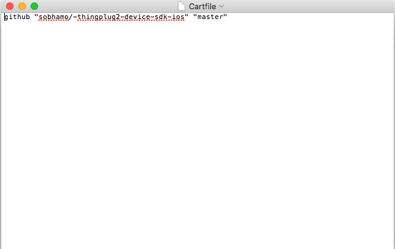
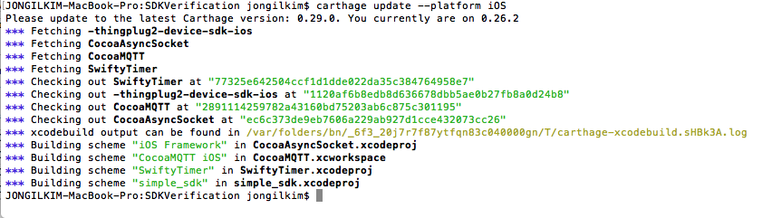
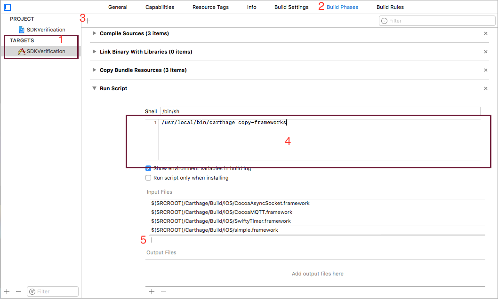
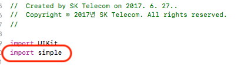

ThingPlug Simple framework for IOS
===

## Overview
ThingPlug Simple framework for IOS는 ThingPlug에 연동하고자 하는 device 개발자 및 application 개발자를 위한 IOS기반 framework입니다. 
IoT device 및 Application과 ThingPlug서버간의 통신에는 Simple 규격에 기반한 MQTT 프로토콜을 따르고 있으며, 보안강화를 위해 TLS를 사용할 수 있도록 구성되어 있습니다

## Features
SDK뿐만 아니라 기본 기능시험을 위한 Simple Test App과  Service Application 역할을 하는 Sample Service App을 같이 배포해드리고 있습니다.

## Requirements
* **[XCODE (9.3)] /  Swift 4.0**

### Library
본 framework에서의 ThingPlug와의 통신은 모두 MQTT를 통해서 이루어기에 MQTT client가 필요합니다.
IOS framework에서는 오픈소스 프로젝트인 CocoaMQTT를 사용하고 있으며, 오픈소스 프로젝트에 대해서는 아래 링크를 참고하시기 바랍니다.

라이브러리 | 기능 | 홈페이지
------------ | ------------- | -------------
CocoaMQTT | MQTT | **[CocoaMQTT github](https://github.com/emqtt/CocoaMQTT)**

## Getting Started
ThingPlug Simple framework는 소스코드 형태로 제공되며 Application에서의 사용을 위해서는 다음과 같이 import하여 사용하면 됩니다.
보다 자세한 사용 예시는 **[SDKVerification App](https://github.com/sobhamo/-thingplug2-app-ios/tree/master/SDKVerification)** 소스코드를 참고하시기 바랍니다.

### Carthage 설치 및 framework 업데이트 
Simple framework는 framework의 원할한 업데이트 적용 및 import 편의를 위하여 [Carthage](https://github.com/Carthage/Carthage)를 사용합니다.

1. Carthage 설치 후 신규 Project 폴더에 Cartfile을 생성하고 아래 1개의 git 저장소 주소를 추가 후 저장합니다.
```
github "sobhamo/-thingplug2-device-sdk-ios" "master"
```



2. 터미널에서 Project 폴더로 이동 후 Carthage update 명령어를 입력합니다.
"carthage update --platform iOS" 후 ENTER


### Project에 Simple framework 연결
신규 Project에 Simple framework를 추가하고자 할 경우, 아래와 같이 추가하시기 바랍니다.

1. TARGETS 선택(1번) -> Build Phases(2번) -> new run Script phase(3번) 
2. Run Script 선택 후  Script 영역(4번) 에 "/usr/local/bin/carthage copy-frameworks" 입력을 합니다.
3. Carthage를 통하여 생성된 frameworks를 Project에 input 합니다.(5번)



### Simple framework import

import simple


### Setting for MQTT connection
MQTT server 와의 연결을 위한 정보를 Simple framework의 Host class 를 통해 설정해야 합니다.

```swift
let HOST = Host(name: "name", host: "host",
                port: " port", clientId: "clientId", 
                userName: "userName", password: "password", 
                usingSSL: false, cleanSession: true)
```
함수 | 파라미터
------------ | -------------
____host___ | MQTT broker 주소
__clientId__ | MQTT 연결 clientID
__userName__ | MQTT 연결 username
__password__ | MQTT 연결 password
____port___ | MQTT 연결 port
__usingSSL__ | SSL 연결 여부
cleanSession | Session 삭제 여부


TLS 사용을 위해서는 MQTT broker 주소앞에 `ssl://` 을 포함하면 됩니다. 포트번호가 `8883`인 경우 생략 가능합니다.

TLS 사용 시, ThingPlug의 MQTT broker 주소는 다음과 같습니다.
```
ssl://thingplugtest.skitiot.com
```
TLS를 사용하지 않을 경우, MQTT broker 주소앞에 `tcp://` 를 포함하면 됩니다. 포트번호가 `1883`인 경우 생략 가능합니다.


### Connects to an MQTT server
MQTT 서버에 연결 후, 각종 이벤트 처리를 위한 MQTTDelegate 선언 및 Delegate function을 추가해 주어야 합니다.

```swift

/**
* MQTT Delegate
*/
public protocol MQTTDelegate {
/// MQTT connected with server
func mqtt(_ mqtt: MQTTClient, didConnect host: String, port: Int)
func mqtt(_ mqtt: MQTTClient, didConnectAck ack: MQTTConnAck)
func mqtt(_ mqtt: MQTTClient, didPublishMessage message: Message, id: UInt16)
func mqtt(_ mqtt: MQTTClient, didPublishAck id: UInt16)
func mqtt(_ mqtt: MQTTClient, didReceiveMessage message: Message, id: UInt16)
func mqtt(_ mqtt: MQTTClient, didSubscribeTopic topic: String)
func mqtt(_ mqtt: MQTTClient, didUnsubscribeTopic topic: String)
func mqttDidPing(_ mqtt: MQTTClient)
func mqttDidReceivePong(_ mqtt: MQTTClient)
func mqttDidDisconnect(_ mqtt: MQTTClient, withError err: Error?)
func mqtt(_ mqtt: MQTTClient, didReceive trust: SecTrust, completionHandler: @escaping (Bool) -> Void)
}

```
파라미터 | 설명
------------ | -------------
__mqttClient__ | mqttClient.delegate 객체

### Simple API 
SKT ThingPlug 서버와 Simple 통신을 위한 API 는 `Simple.swift` 파일에 주로 정의되어 있습니다.
simple 클래스 객체를 가져와 사용하면 됩니다.

함수 | 설명
------------ | -------------
__tpSimpleTelemetry__ |     센서정보를 전달한다.
__tpSimpleRawTelemetry__ | 센서정보를 전달한다.(RAW data)
__tpSimpleAttribute__ | 디바이스 정보를 전달한다.
__tpSimpleRawAttribute__ | 디바이스 정보를 전달한다.(RAW data)
__tpSimpleResult__ | RPC 제어결과를 전달한다.
__tpSimpleRawResult__ | RPC 제어결과를 전달한다.(RAW data)
__tpSimpleSubscribe__ | 디바이스정보를 모니터링 한다.
> 각 함수별 파라미터 설명은 `Simple.swift`에서 확인


## Sample Application(s)
* **[Simple Test App](https://github.com/sobhamo/-thingplug2-app-ios/tree/master/SDKVerification)** - Simple framework 사용 Test App
* **[Simple Service App](https://github.com/sobhamo/-thingplug2-app-ios/tree/master/SDKVerification)** - Simple framework 사용 Test App


Copyright (c) 2017 SK Telecom Co., Ltd. All Rights Reserved.
Distributed under Apache License Version 2.0.
